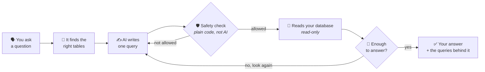

# data-agent

**Ask your business data a question in normal English. Get an answer you can
check.**

No dashboards to build. No SQL to write. No waiting for the data team.

---

## Try it now

**→ [Open the app](https://ca-dataagent-web-dev.redhill-410ea877.southeastasia.azurecontainerapps.io)**

Sign in with this demo account:

| | |
|---|---|
| **Email** | `charliemdl02@gmail.com` |
| **Password** | `Pass@12345` |

It is loaded with real data from a Malaysian restaurant chain — five outlets, a
year of sales, and a year of food waste.

### Questions worth asking

Copy any of these in:

> How much food did we waste last year?

> Which outlet sells the most?

> What is causing our waste?

> Which dishes make us the most money?

Then try one it **cannot** answer, because that is the interesting part:

> How many customers came in on Tuesday?

The restaurant does not count customers, so there is no honest answer. It will
tell you that instead of making one up.

**Answers take about one to three minutes.** It is not looking things up — it is
working them out, one query at a time. You can watch it think while it goes.

---

## The problem

Every business keeps its answers in a database. Almost nobody can get them out.

- **Asking a person is slow.** Your question becomes a ticket. The ticket takes
  days.
- **Dashboards answer last year's question.** They show what somebody thought to
  build. Not what you need today.
- **A chatbot on top of a database is worse than useless.** It sounds sure of
  itself, invents things that are not there, and gives you a number you cannot
  check.

That last one is the real danger. A wrong number that looks right gets used in a
real decision.

---

## How it works

**It works like a person would.** It looks at some data, thinks about what it
found, and looks again if it needs more. That is why it takes a minute or two,
and why it can answer questions a single lookup could not.

**The safety check is ordinary code, not AI.** Before any query touches your
database, plain code checks it: is it read-only, do these tables really exist,
is there a limit on how much it can pull. If the AI gets something wrong, the
check catches it and the AI tries again. **You never see that happen** — it just
means the answer is right.

**It can only read.** There is no version of this that can change or delete
anything.

---

## Why you can trust the answer

**Every number comes with its receipt.** Click on any answer and you can read the
exact query that produced it, and the rows it came back with. Nothing is hidden
behind "the AI said so".

**It admits what it does not know.** Under each answer is a short note about what
that answer does *not* prove — a date range the data does not cover, a figure
that is an estimate rather than a measurement. **The app writes those notes, not
the AI**, so the AI cannot talk its way around them.

**It says no.** If your data cannot answer the question, it says so and explains
what is missing. That is treated as a good outcome, not a failure.

**It learns your words.** "Net revenue" means something particular in your
business. You write that down once, and every answer that uses the term follows
your meaning — including any warning you attach to it.

---

## What it will not do

- **It will not change your data.** Read-only, always.
- **It will not guess.** If the answer is not in your data, it tells you.
- **It will not replace your judgement.** It tells you what the numbers say. What
  to do about them is still yours.

---

## Want more detail?

| | |
|---|---|
| [How it works, in detail](docs/how-it-works.md) | The same thing explained properly, with the full diagrams. |
| [Run it yourself](docs/setup.md) | Install it on your own machine, about ten minutes. |
| [Architecture](docs/architecture.md) | The technical design. |

The demo account above is read-only and exists for people trying the
product. No license yet, so all rights reserved.
