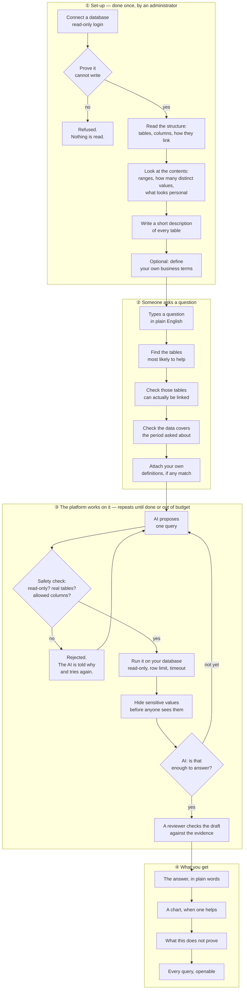
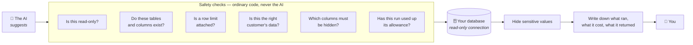
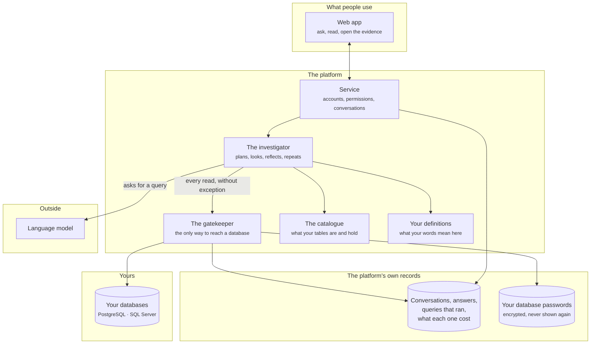

# data-agent

**Ask your business database a question in plain English. Get an answer you can
check.**

You connect a database you already have. The platform reads its structure, works
out what is in it, and then answers questions about it — in sentences, with a
chart where one helps, and with the exact query behind every number one click
away.

It is built on one rule: **the AI is never allowed to be the thing that keeps
your data safe.** Ordinary code does that. The AI only suggests; code checks
every suggestion before anything touches your database.

---

## The problem this solves

Most businesses have the answer to their questions sitting in a database, and no
practical way to ask.

- **Asking a person is slow.** Every question becomes a ticket, and the ticket
  takes days.
- **Dashboards answer yesterday's question.** They show what someone thought to
  build. The question you have today is usually not on there.
- **A chatbot bolted onto a database is worse than nothing.** It sounds
  confident, invents columns that do not exist, and gives you a number with no
  way to tell whether it is right.

The third one is the real danger. A wrong number that looks right gets used.

---

## What makes this different

**Every number can be traced.** Each answer names the queries that produced it.
You can open any of them and read the actual SQL, and see the rows it returned.

**It says when it cannot answer.** If your database has no table for what you
asked, it tells you that instead of guessing. An honest "I cannot answer this"
is treated as a successful outcome, not a failure.

**It says what an answer does not prove.** Below each answer is a short list of
limitations — a period the data does not cover, a join that was measured rather
than declared, a figure that is modelled rather than measured. **The platform
writes those, not the AI**, so the AI cannot smooth them away.

**It cannot change your data.** The platform connects with a read-only login and
refuses to use one it has not proved is read-only.

**It knows your words.** "Net revenue" means something specific in your business.
You can write that down once, and every answer that uses the term then follows
your definition — including the warnings you attach to it.

---

## How it works, end to end

Three separate things happen: you **set it up** once, someone **asks** a
question, and the platform **works** on it.

### What that means, step by step

**① Set-up.** An administrator connects a database using a login that can only
read. The platform tests that login and **refuses to go further if it can write
anything** — a catalogue is only worth building on credentials that cannot change
the data.

It then reads the structure and takes a careful look at the contents: how many
distinct values each column holds, what range they fall in, what a typical value
looks like, and whether anything looks like personal information. Columns that
look sensitive are hidden by default until an administrator decides otherwise.

Finally it writes a short description of each table — this is what lets a
question about "sales last month" find the right table without anyone having
typed the word "sales" into the schema.

**② Someone asks.** The platform first works out which tables are likely to
help, using both the words in the question and their meaning, so "takings"
finds a table about revenue. Then it checks three things before any AI is asked
to write a query:

- Can those tables actually be joined? If two tables cannot be linked, an answer
  combining them would be fiction.
- Does the data cover the period asked about? If you ask about last month and the
  data stops a year ago, that is worth knowing before, not after.
- Do any of your own definitions apply to this question?

**③ The platform works.** This is a loop, not a single shot. The AI proposes one
query at a time. Every proposal goes through a safety check written in ordinary
code — is it read-only, does every table and column actually exist, is a row
limit attached. **A rejected query is not a failure**: the AI is told exactly what
was wrong and tries again, which is how most mistakes get corrected without
anyone noticing.

Queries that pass run against your database read-only, with a row cap and a time
limit. Sensitive values are hidden before anything is shown to the AI or to you.

The AI then looks at what came back and decides whether it has enough. If not, it
asks another question of the data. That is the difference between this and
text-to-SQL: it can look, think, and look again.

Before the answer is written, a separate reviewer step checks the draft against
the evidence — that every number cited is real, and that any filter your
definitions require was actually applied.

**④ What you get.** An answer in plain words. A chart when one helps. A list of
what the answer does not establish. And every query, openable.

---

## What stops it going wrong

The AI suggests. Code decides. Every one of those checks is ordinary code with
a test behind it, and **none of them can be argued with by a cleverly worded
question**, because none of them asks the AI anything.

| Concern | What actually prevents it |
|---|---|
| "Could it change or delete our data?" | The login it uses can only read, and the platform proves that before reading anything. Every query is checked to be read-only as well. |
| "Could it see another customer's data?" | Every table in the platform's own database is scoped per organisation by the database itself, not by application code that could forget. |
| "Could it leak personal data?" | Columns that look sensitive are hidden by default. Hiding happens before the AI sees the rows, not after. |
| "Could a clever question talk it into something?" | The safety checks do not consult the AI. A question cannot argue with code that never asks its opinion. |
| "Could it run up a huge bill?" | Every run has a fixed allowance — steps, queries, time, and model usage — counted by the platform, not promised by a prompt. |
| "Could it quietly give us a wrong number?" | Every number names the query behind it, and you can read that query. |

---

## How it is put together

**The gatekeeper is the point.** There is exactly one path from anything in this
system to a database of yours, and it is the layer marked above. Every read goes
through it — including the platform's own housekeeping. That is what makes the
safety checks meaningful: there is no second route that skips them.

**Your passwords are never shown again.** A database credential is encrypted the
moment it is given and stored apart from everything else. It is never returned by
any screen, never written to a log, and never included in an error message.

**The AI is kept outside.** It is sent a description of your tables and the rows
a query returned. It is never given a password, never given a connection to your
database, and never asked a question whose answer decides whether something is
allowed.

---

## What you see with an answer

Every answer carries four things, and the last three are the reason to trust the
first.

| | |
|---|---|
| **The answer** | In plain words, for someone who is not an analyst. |
| **How it was reached** | One line: how many queries, over how many steps, against which tables. |
| **What it does not prove** | Written by the platform, not the AI. A period not covered, a link that was measured rather than declared, a number that is modelled rather than counted. |
| **The evidence** | Every query, openable, with the rows it returned. |

While a question is being worked on you can see how far it has got — which step
it is on, and how much of its allowance is left. If it is close to running out,
it says so **before** the answer arrives, so you know to read the answer as
partial.

---

## Teaching it your business

The platform can read a database's structure. It cannot read your mind, and the
same word means different things at different companies.

A **definition** fixes that. You write down, once:

- what a term means in your business,
- the words people actually use for it,
- optionally, a rule every query for that term must follow,
- and **any warning that must appear whenever it is used**.

That last one matters more than it sounds. If your waste figures are estimates
rather than measurements, every answer that uses them says so — because the
warning travels with the definition rather than living in someone's head.

The platform is also honest about its own enforcement. If a definition has a rule
attached but that rule currently excludes nothing — because the data changed
underneath it — the screen says **"enforced, but currently excluding nothing"**
rather than claiming a guarantee it is not delivering.

---

## What it does not do

Worth saying plainly.

- **It does not write to your database.** There is no version of this that does.
- **It does not work without an AI model.** There is no offline mode. The product
  *is* the investigation.
- **It is not a replacement for an analyst** on questions that need judgement
  about what the numbers mean for your business.
- **It cannot answer what the data cannot support.** If the table you would need
  does not exist, no amount of asking differently will produce it — and it will
  tell you so rather than making a number up.
- **It does not guarantee the AI's wording.** The numbers are checked; the prose
  around them is the model's, guided by instructions.

---

## What it works with

**Databases:** PostgreSQL and SQL Server.

**Signing in:** your existing company login. Each organisation's data is kept
apart by the database itself, and people can be given Admin, Contributor or
Reader access — a Reader can ask questions and read their own answers, and
cannot change what anything means.

---

Installing and running it: [docs/setup.md](docs/setup.md) · Technical
design: [docs/architecture.md](docs/architecture.md) · No license yet, so all
rights reserved.
