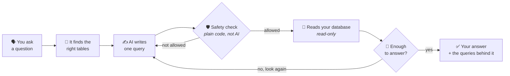

# 🍽️ data-agent

### Ask your business data a question in normal English. Get an answer you can check.

**No dashboards to build · No SQL to write · No waiting for the data team**

[**🚀 Try the live app →**](https://ca-dataagent-web-dev.redhill-410ea877.southeastasia.azurecontainerapps.io)

---

## 💡 What is it?

Every business keeps its answers in a database. Almost nobody can get them out
without asking somebody who can write SQL.

**data-agent lets anyone just ask.** Type *"which outlet wastes the most food?"*
and it goes and works it out — reading your data, checking what it found, and
looking again if it needs more, the way an analyst would.

Then it shows you **exactly how it got there**. Every number comes with the query
behind it, one click away. If your data cannot answer the question, it tells you
that instead of inventing something.

It is built on one rule: **🔒 the AI is never the thing keeping your data safe.**
Plain code does that. The AI only suggests, and every suggestion is checked
before it goes anywhere near your database.

---

## 📖 Contents

| | |
|---|---|
| 🚀 **[Try it](#-try-it)** | The live app, a login, and what to ask |
| 🎯 **[The problem, and the fix](#-the-problem-and-the-fix)** | Why this is not another chatbot |
| ⚙️ **[How it works](#-how-it-works)** | One diagram, plain words |
| 📚 **[More detail](#-more-detail)** | Deeper docs, if you want them |

---

## 🚀 Try it

**→ [Open the app](https://ca-dataagent-web-dev.redhill-410ea877.southeastasia.azurecontainerapps.io)**

| | |
|---|---|
| 📧 **Email** | `charliemdl02@gmail.com` |
| 🔑 **Password** | `Charie@02` |

It is loaded with real data from a Malaysian restaurant chain — **five outlets, a
year of sales, and a year of food waste.**

### ✍️ Questions worth asking

Copy any of these in:

> 💰 How much food did we waste last year?

> 🏪 Which outlet sells the most?

> 🗑️ What is causing our waste?

> 📈 Which dishes make us the most money?

### 🙅 Then try one it *cannot* answer

> ❓ How many customers came in on Tuesday?

The restaurant does not count customers, so there is no honest answer. **It will
tell you that instead of making one up** — which is the whole point, and the
fastest way to see the difference.

> ⏱️ **Answers take one to three minutes.** It is not looking something up — it is
> working it out, one query at a time. You can watch it think while it goes.

---

## 🎯 The problem, and the fix

| | The old way | 😞 Why it fails |
|---|---|---|
| 👤 | **Ask a person** | Your question becomes a ticket. The ticket takes days. |
| 📊 | **Build a dashboard** | It answers what somebody thought to build last year. Not what you need today. |
| 🤖 | **Bolt a chatbot on** | It sounds sure of itself, invents things that are not there, and hands you a number you cannot check. |

**That last one is the real danger.** A wrong number that looks right gets used in
a real decision.

### ✅ What data-agent does instead

| | |
|---|---|
| 🧾 **Shows its receipts** | Every number comes with the exact query that produced it. Click and read it. |
| 🙅 **Says no** | If your data cannot answer, it says so and explains what is missing. |
| ⚠️ **Admits the gaps** | Under each answer is a note on what it does *not* prove. **The app writes those, not the AI**, so the AI cannot talk around them. |
| 🔒 **Cannot touch your data** | Read-only, always. There is no version of this that can change anything. |
| 🗣️ **Learns your words** | "Net revenue" means something particular in your business. Write it down once and every answer follows it. |

---

## ⚙️ How it works

**🔁 It works like a person would.** It looks at some data, thinks about what it
found, and looks again if it needs more. That is why it takes a minute or two —
and why it can answer questions a single lookup never could.

**🛡️ The safety check is ordinary code, not AI.** Before any query reaches your
database, plain code checks it: is it read-only, do these tables really exist, is
there a limit on how much it can pull. If the AI gets something wrong the check
catches it and the AI tries again. **You never see that happen** — it just means
the answer is right.

**🔒 It can only read.** Always.

---

## 🚫 What it will not do

- **Change your data.** Read-only, always.
- **Guess.** If the answer is not in your data, it tells you.
- **Replace your judgement.** It tells you what the numbers say. What to do about
  them is still yours.

---

## 📚 More detail

| | |
|---|---|
| 🔍 [**How it works, in detail**](docs/how-it-works.md) | The same thing explained properly, with full diagrams. |
| 💻 [**Run it yourself**](docs/setup.md) | Install it on your own machine — about ten minutes. |
| 🏗️ [**Architecture**](docs/architecture.md) | The technical design. |

The demo account above is read-only and exists for people trying the product. 
No license yet, so all rights reserved.

